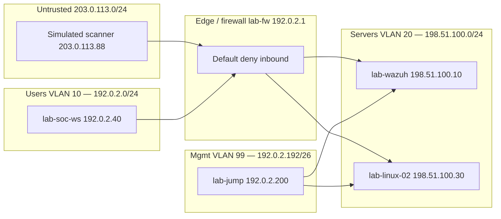

# Lab network diagram

```mermaid
flowchart LR
  subgraph untrusted ["Untrusted 203.0.113.0/24"]
    ATT["Simulated scanner 203.0.113.88"]
  end
  subgraph edge ["Edge / firewall lab-fw 192.0.2.1"]
    FW["Default deny inbound"]
  end
  subgraph users ["Users VLAN 10 — 192.0.2.0/24"]
    WS["lab-soc-ws 192.0.2.40"]
  end
  subgraph servers ["Servers VLAN 20 — 198.51.100.0/24"]
    WZ["lab-wazuh 198.51.100.10"]
    WEB["lab-linux-02 198.51.100.30"]
  end
  subgraph mgmt ["Mgmt VLAN 99 — 192.0.2.192/26"]
    JMP["lab-jump 192.0.2.200"]
  end
  ATT --> FW
  WS --> FW
  FW --> WZ
  FW --> WEB
  JMP --> WZ
  JMP --> WEB
```

Internet-facing allow list in this lab: **none** except HTTPS to the web lab after a change ticket. SSH only from `lab-jump`.
